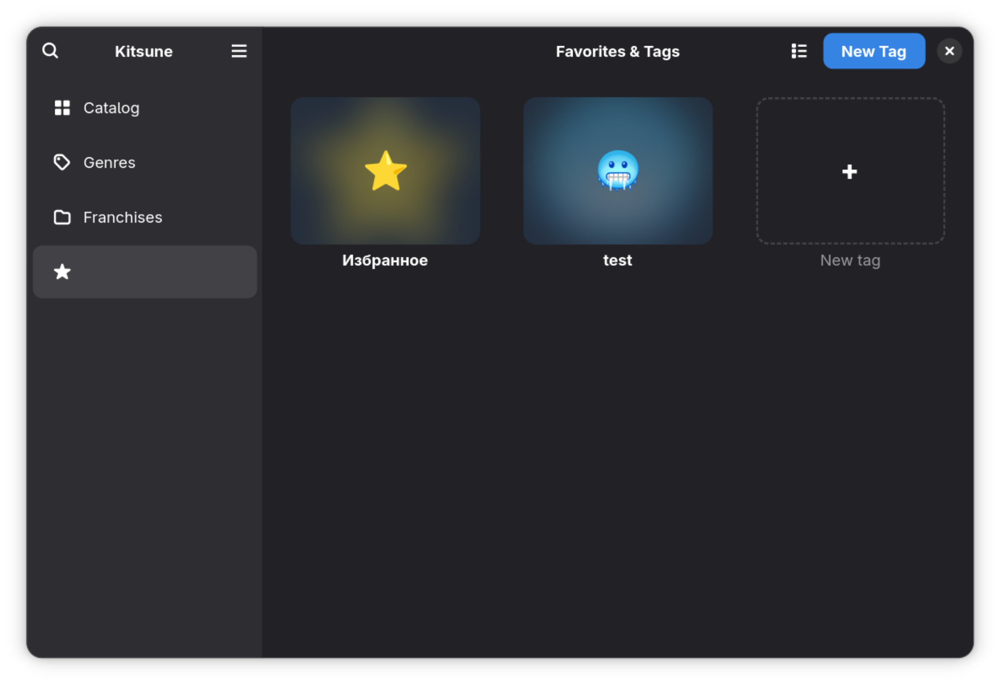
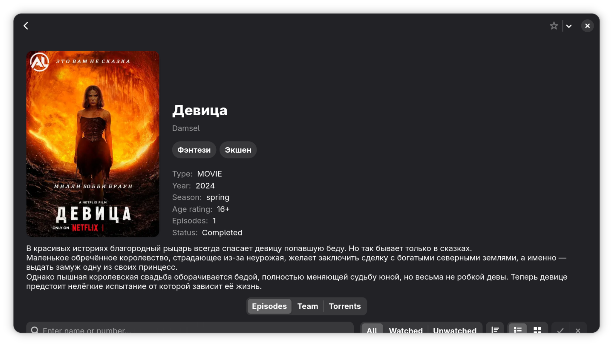
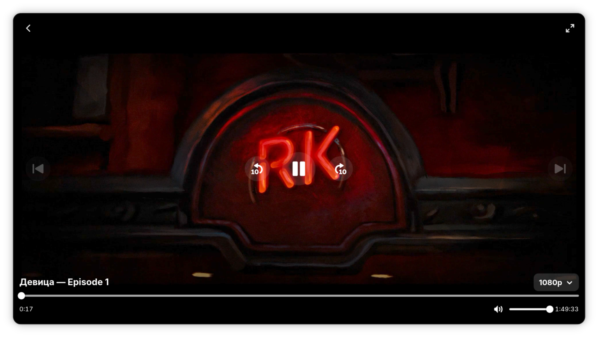
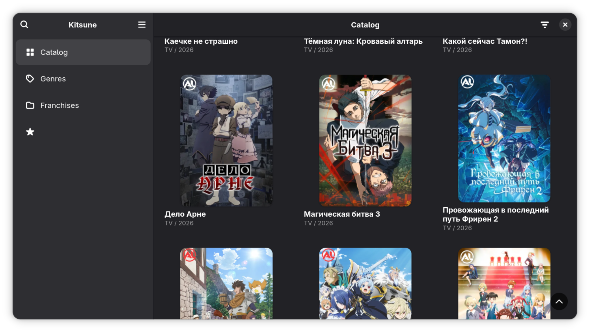

<h1 align="center">Vkr</h1>

> Клиент для просмотра и потоковой передачи медиаконтента для ОС Linux. Весь контент представлен на русском языке, с ресурса [AniLiberty](https://anilibria.top) .

## Особенности

- Интуитовно понятное приложение сделанное на базе GTK и Python
- Сделано с соблюдением рекомендаций GNOME HIG
- Встроенный плеер с воспроизведением HLS и контролем качества
- Каталог с сортировкой по жанру, году выхода, типу и т.д
- Поиск с мгновенной выдачей
- Страница франшизы с подробной информацией
- Возможность ставитб теги и организовывать свою библиотеку
- Отображение прогресса
- Поддержка русского и английского языков

## Снимки экрана

<p align="center">
  
  
  
  
</p>

### Сборка

**Зависимости:**

- Python 3.12+
- GTK 4
- Libadwaita >= 1.6
- GStreamer >= 1.24 (с плагинами gtk4paintablesink и hlsdemux)
- Libsoup 3
- Meson 1.0+
- Blueprint Compiler
- python3-keyring

**Сборка и установка:**

```bash
meson setup _build
meson compile -C _build
sudo meson install -C _build
```

**Runtime dependencies:**

Для воспроизведения видео так же понадобятся:

- gst-plugin-gtk
- libwebp-pixbuf-loader
